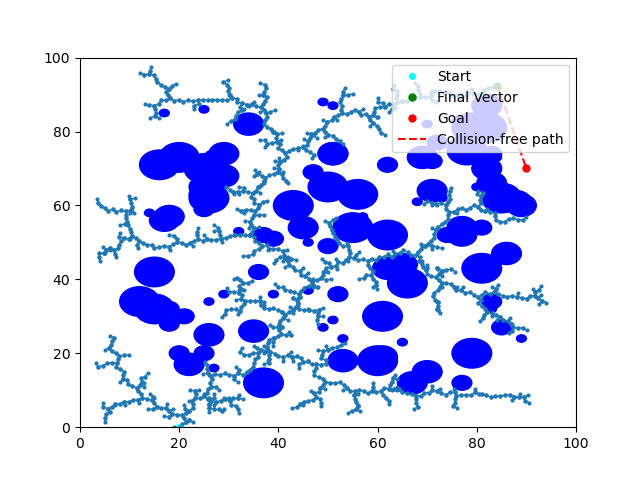

# RRT-Algorithm

This repository is my implementation of the RRT algorithm.

## How does it work?
1. Initialization

    The algorithm starts by defining a starting position (root of the tree) and a goal position. It also defines the environment, including obstacles that must be avoided.

2. Random Sampling

    At each iteration, the algorithm samples a random configuration (a point in the space), which could be anywhere in the defined search space.

3. Nearest Vertex

    The algorithm finds the vertex (node) in the current tree that is closest to the random sample.

4. New Configuration

    A new node is generated by extending from the nearest vertex in the direction of the random sample. The new node is created at a predefined step size to avoid overshooting obstacles or the goal.

5. Collision Check

    The algorithm checks whether the new node is in collision with any obstacles. If a collision is detected, the node is discarded.

6. Expand Tree

    If the new node is collision-free, it is added to the tree, and an edge is created from the nearest vertex to the new node.

7. Goal Check

    The algorithm if a direct, collision-free path to the goal is possible, the algorithm terminates.

8. Iterate

    The process is repeated until a valid path to the goal is found or a maximum number of iterations is reached.

## Example Output

The implementation was completed in September 2024 during the MSR program kick-off hackathon at Northwestern University